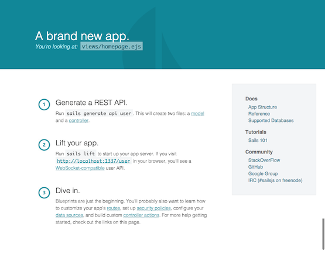

# testProject
## Getting Started with Sails

Sails.js has a wonderful [video intro](https://www.youtube.com/watch?v=GK-tFvpIR7c) but the syntax has changed in newer releases

### Install Sails on OSX

```
brew install node
npm install sails -g
sails -v
```
last tested with: ```0.10.5```

### Make a Project

```
sails new testProject
cd testProject
sails lift
```
In your browser, go to: http://localhost:1337/

You will see the sails app is running with some references to what to do next:



```ctrl-c``` to stop the server

### Make a REST API

For development we'll let Sails automatically rebuild the tables/collections/etc. in our schema.

in ```sails config/model.js``` the migrate configuration is 'alter' by default, which is perfect for testing.  Later, in production, we'll likely want to switch that to 'safe.'

We'll use the sails generator to create an API, which consists of a model and a controller:


```
sails generate api user
sails lift
```

Now in the browser http://localhost:1337/user returns a JSON representation of our list of users
```
[]
```

Let's make some users
```
http://localhost:1337/user/create?name=Tim
http://localhost:1337/user/create?name=Judy
http://localhost:1337/user/create?name=Lee
http://localhost:1337/user/create?name=Maggie
```

creates users
in browser, go to: http://localhost:1337/user/
```
[
  {
    "name": "Tim",
    "createdAt": "2014-12-21T18:20:19.382Z",
    "updatedAt": "2014-12-21T18:20:19.382Z",
    "id": 1
  },
  {
    "name": "Judy",
    "createdAt": "2014-12-21T18:20:26.269Z",
    "updatedAt": "2014-12-21T18:20:26.269Z",
    "id": 2
  },
  {
    "name": "Lee",
    "createdAt": "2014-12-21T18:20:29.338Z",
    "updatedAt": "2014-12-21T18:20:29.338Z",
    "id": 3
  },
  {
    "name": "Maggie",
    "createdAt": "2014-12-21T18:20:32.879Z",
    "updatedAt": "2014-12-21T18:20:32.879Z",
    "id": 4
  }
]```

We can create attributes, like this
http://localhost:1337/user/update/1?email=tim@whatever.com
```
{
  "name": "Tim",
  "createdAt": "2014-12-21T18:20:19.382Z",
  "updatedAt": "2014-12-21T18:25:20.248Z",
  "id": 1,
  "email": "tim@whatever.com"
}

```

using POST

```
curl -X POST -d "{}" -H "Content-Type: application/jon" http://localhost:1337/user/find
```
returns all the users, just like http://localhost:1337/user in the browser, but now I can adjust what I'm looking for

```
curl -X POST -d '{"limit":2}' -H "Content-Type: application/jon" http://localhost:1337/user/find
```
returns
```
[
  {
    "name": "Tim",
    "createdAt": "2014-12-21T18:20:19.382Z",
    "updatedAt": "2014-12-21T18:25:20.248Z",
    "id": 1,
    "email": "tim@whatever.com"
  },
  {
    "name": "Judy",
    "createdAt": "2014-12-21T18:20:26.269Z",
    "updatedAt": "2014-12-21T18:20:26.269Z",
    "id": 2
  }
]
```
or in the browser: http://localhost:1337/user?limit=2


with sorting
```
curl -X POST -d '{"limit":2, "sort":"name ASC"}' -H "Content-Type: application/jon" http://localhost:1337/user/find
```

other options:
```
curl -X POST -d '{"where": {"name": {"contains":"e"}}}' -H "Content-Type: application/json" http://localhost:1337/user/find

[
  {
    "name": "Lee",
    "createdAt": "2014-12-21T18:20:29.338Z",
    "updatedAt": "2014-12-21T18:20:29.338Z",
    "id": 3
  },
  {
    "name": "Maggie",
    "createdAt": "2014-12-21T18:20:32.879Z",
    "updatedAt": "2014-12-21T18:20:32.879Z",
    "id": 4
  }
]


curl -X POST -d '{"where": {"name": {"startsWith":"L"}}}' -H "Content-Type: application/json" http://localhost:1337/user/find
[
  {
    "name": "Lee",
    "createdAt": "2014-12-21T18:20:29.338Z",
    "updatedAt": "2014-12-21T18:20:29.338Z",
    "id": 3
  }
]
```

Under the hood we're using [Sails Blueprints](http://sailsjs.org/#/documentation/reference/blueprint-api) which is configured by default to provide a REST API for each model/controller.


## Check out sockets
Open Javascript console in the browser, and you will see
```
    |>
  \___/
sails.io.js:200  `io.socket` connected successfully.
```

Also, provides a link to [BrowserSDK docs](http://sailsjs.org/#!documentation/reference/BrowserSDK/BrowserSDK.html)

Take a look at assets/linker/js/app.js where you will see the code that creates that output

Try this at the console:
```
io.socket.get('/user', {}, function (users) {console.log(users)})
```
and you will see your list of users


Let's listen for changes to any user model:
```
   io.socket.on('user', function messageReceived(event) {
    console.log('New comet message received :: ', event);
    });
```

in another browser window:
```
http://localhost:1337/user/create?name=Eva
```

then see this
```
New comet message received ::
Object {model: "user", verb: "create", data: Object, id: 5}
```

expand the object to see the data for that object is available

## Lock it down

in config/policies.js
```
module.exports.policies = {

  // Default policy for all controllers and actions
  // (`true` allows public access)
  '*': true
```
indicates that anyone can ask the server for anything

we'll change what is accessible on the user model
```
module.exports.policies = {

  // Default policy for all controllers and actions
  // (`true` allows public access)
  '*': true,

  'user': {
    '*': 'sessionAuth',
    'findOne': true,
    'find':true
  }
```

This refers to an 'sessionAuth' policy that is defined already in api/policies/sessionAuth.js  (this is actually just express middleware)

then if you go to http://localhost:1337/user that works

but if you try to create a user:
```
http://localhost:1337/user/create?name=Mary
```
you get a 403 forbidden


## Questions

* Where's the data?

By default, Sails uses simple disk storage for development only.  You can see this in 'config/adapters.js'

```
module.exports.adapters = {

  // If you leave the adapter config unspecified
  // in a model definition, 'default' will be used.
  'default': 'disk',

  // Persistent adapter for DEVELOPMENT ONLY
  // (data is preserved when the server shuts down)
  disk: {
    module: 'sails-disk'
  },


```
